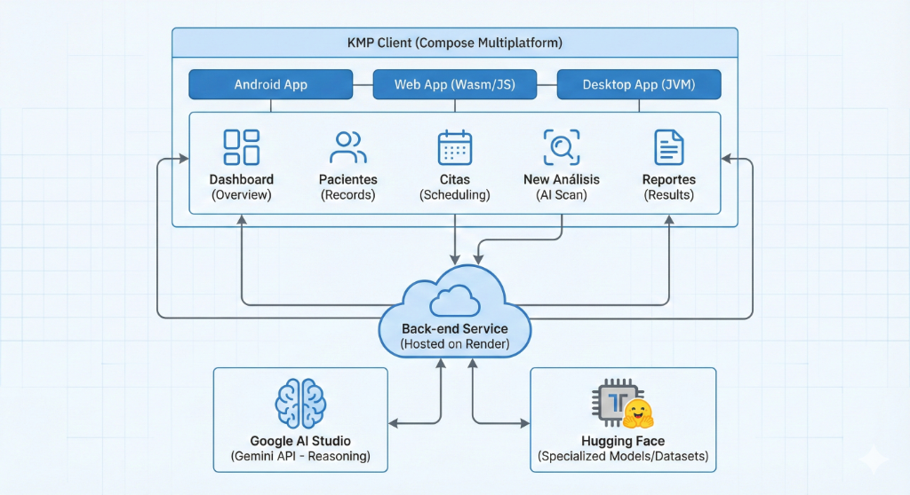

# Dental Vision AI - Kotlin Multiplatform

Professional dental AI analysis system with YOLOv12 integration for cross-platform deployment.

**Contest Submission:** Three-Platform Implementation (Android, Desktop, Web)

## Table of Contents

1. [Overview](#overview)
2. [Demo Videos](#demo-videos)
3. [Quick Start for Judges](#quick-start-for-judges)
4. [External APIs and Architecture](#external-apis-and-architecture)
5. [Setup and Configuration](#setup-and-configuration)
6. [Testing Resources](#testing-resources-and-sample-data)
7. [Supported Platforms](#supported-platforms)
8. [Architecture](#architecture)
9. [Key Features Highlight](#key-features-highlight)
10. [Backend Integration](#backend-integration)
11. [Installation Manual](#installation-manual)
12. [Development](#development)
13. [Troubleshooting](#troubleshooting)
14. [License](#license)
15. [Author](#author)

## Overview

Dental Vision AI is a cross-platform application for dental image analysis powered by the YOLOv12 deep learning model. The system provides comprehensive patient management, automated dental image analysis, and professional clinical reporting capabilities across Android, Desktop, and Web platforms.

**Primary Platforms:** Android, Desktop (Windows, macOS, Linux), and Web (Wasm/JS).
**Experimental Support:** iOS implementation is currently partial and not a primary target for this release.

## Demo Videos

<table>
<tr>
<td width="50%" align="center">

### Contest Demo (8 min)

[](https://www.youtube.com/watch?v=P7qHrPUVlpY)

**Platforms:** Android, Desktop, Web

[**Watch Demo**](https://www.youtube.com/watch?v=P7qHrPUVlpY)

</td>
<td width="50%" align="center">

### Technical Deep Dive (26 min)

[](https://www.youtube.com/watch?v=ZGjs8cYaYCI)

**For:** Judges & Developers

[**Watch Full Presentation**](https://www.youtube.com/watch?v=ZGjs8cYaYCI)

</td>
</tr>
</table>

### Contest Demo Highlights

The 8-minute demo showcases all three platform implementations:
- **Android:** Material You theming, native UI, touch interactions
- **Desktop:** Window management, file dialogs, keyboard shortcuts
- **Web:** Progressive Web App, browser compatibility

### Technical Presentation Contents

The 26-minute deep dive covers:
- System architecture and MVVM design patterns
- Kotlin Multiplatform implementation details
- External API integrations (Gemini, HuggingFace, Render)
- Live IDE walkthrough with code demonstration
- Database design and real-time debugging workflow

## Quick Start for Judges

For rapid evaluation and testing, follow these streamlined steps:

### 1. Pre-compiled Binaries (Fastest Method)

Download ready-to-use executables from [GitHub Releases v1.0.0](https://github.com/DavidHospinal/FrontDentalVisionkmp/releases/tag/v1.0.0):

- **Android:** `DentalVisionAI-v1.0.0.apk`
- **Desktop:** Platform-specific installers (.msi for Windows, .dmg for macOS, .deb for Linux)
- **Web:** Access directly at deployment URL (if available)

**Demo Credentials:**
- Username: admin
- Password: admin123

### 2. Wake Up Cloud Services

Before first login, activate the free-tier backend services (takes 30-60 seconds):

1. Open [Backend Service](https://backenddental-vision-ai.onrender.com/) - wait for JSON response
2. Open [AI Model Service](https://huggingface.co/spaces/DavidHosp/Dental-vision-kmp-contest) - wait for Gradio interface

### 3. Test with Sample Data

- Sample dental images located in: `samples-images/` folder
- Use New Analysis feature to upload and analyze images
- View AI-generated clinical insights powered by Gemini API

### 4. Build from Source (Optional)

If building from source code:

1. Clone repository: `git clone https://github.com/DavidHospinal/FrontDentalVisionkmp.git`
2. Configure Gemini API key (see Setup section below)
3. Build for your platform (see Installation Manual section)

## External APIs and Architecture

This project integrates three key external services to deliver a robust AI-powered dental analysis solution:

| Service | Purpose | Details |
|---------|---------|---------|
| **Gemini API (Google)** | AI-Powered Clinical Insights | Generates personalized clinical recommendations, treatment plans, and diagnostic summaries based on YOLOv12 detection results. Provides natural language explanations for dental professionals. |
| **Hugging Face** | ML Model Hosting | Hosts the YOLOv12 dental detection model via Gradio Spaces. Provides REST API endpoints for real-time dental image analysis with bounding box detection and confidence scoring. |
| **Render** | Backend Deployment | Hosts the Python Flask backend that orchestrates communication between the KMP frontend, HuggingFace inference API, and SQLite database. Handles patient management, analysis history, and report generation. |

### Architecture Diagram



## Setup and Configuration

### Zero Configuration Setup (Ready to Run)

This project is pre-configured for immediate evaluation with all necessary API keys included. No additional setup is required to build and run the application on any of the three supported platforms.

#### Included Demo API Key

The codebase includes a pre-configured demo Gemini API key in `composeApp/src/commonMain/kotlin/com/dentalvision/ai/data/remote/api/Secrets.kt` specifically for Kotlin Multiplatform Contest evaluation purposes. This key is temporary and will be revoked after the contest evaluation period.

#### Quick Start for Contest Judges

1. Clone the repository: `git clone https://github.com/DavidHospinal/FrontDentalVisionkmp.git`
2. Navigate to the project directory: `cd FrontDentalVisionkmp`
3. Build for your target platform (see Installation Manual section below)
4. Run the application - no configuration needed

The application will work immediately on Android, Desktop, and Web platforms without any additional setup steps.

#### Pre-compiled Binaries

For even faster evaluation, pre-compiled binaries are available in the [Releases](https://github.com/DavidHospinal/FrontDentalVisionkmp/releases/tag/v1.0.0) section:
- Android APK ready to install
- Desktop installers for Windows, macOS, and Linux
- Demo credentials: admin / admin123

#### Security Note for Production Use

IMPORTANT: In production environments, API keys should NEVER be committed to version control. The demo API key is included solely for contest evaluation convenience and intentionally violates standard security best practices for judging purposes.

For production deployment after the contest, replace the demo key in `Secrets.kt` with your own API key from [Google AI Studio](https://aistudio.google.com/app/apikey) and ensure the file is listed in `.gitignore`.

## Testing Resources and Sample Data

To facilitate quick testing and demonstration, the repository includes ready-to-use sample data.

### Sample Images Folder

- **Location:** `samples-images/` directory in the project root
- **Contents:** 5 professionally curated dental images for immediate testing
- **Usage:** These images are pre-validated to work optimally with the YOLOv12 detection model

### Supported Input Format

The model strictly supports **standard RGB dental photography** (JPG, PNG formats). This includes intraoral photographs and standard dental images captured with conventional cameras or smartphone devices.

### Testing Flexibility

- You are not limited to the provided samples
- Use your own dental photographs in standard formats (JPG, PNG)
- Download external dental image datasets for extensive testing

### Quick Test Workflow

1. Launch the application (see Build Instructions below)
2. Navigate to "New Analysis" from the main menu
3. Select a patient or create a test patient
4. Upload an image from `samples-images/` or your own source
5. View real-time detection results with bounding boxes
6. Review the in-app professional clinical report with insights and recommendations

## Supported Platforms

Current implementation status across Kotlin Multiplatform targets:

| Platform | Status | Details |
|----------|--------|---------|
| Android | Fully Functional | API 24+ (Android 7.0+), tested on physical devices and emulators |
| Desktop (JVM) | Fully Functional | Windows, macOS, Linux support with native window decorations |
| Web (Wasm/JS) | Fully Functional | Modern browsers with WebAssembly support, fallback to JS |
| iOS | Partial/Experimental | Beta implementation, UI functional, backend integration pending |

### Platform-Specific Features

- **Android:** Material You dynamic theming, notification support
- **Desktop:** Menu bar integration, file picker dialogs
- **Web:** Progressive Web App (PWA) capabilities, offline mode

## Architecture

### Technology Stack

| Component | Technology | Version |
|-----------|------------|---------|
| UI Framework | Compose Multiplatform with Material3 | 1.7.1 |
| Backend Communication | Ktor Client | 3.0.0 |
| Serialization | Kotlinx Serialization | 1.7.3 |
| Dependency Injection | Koin | 4.0.0 |
| State Management | AndroidX Lifecycle ViewModel + StateFlow | 2.8.2 |
| Navigation | AndroidX Navigation Compose | 2.8.0-alpha10 |
| Logging | Napier | 2.7.1 |
| Image Loading | Kamel | 1.0.3 |

### Project Structure

```
composeApp/
├── src/
│   ├── commonMain/          # Shared code (95%+)
│   │   └── kotlin/com/dentalvision/ai/
│   │       ├── App.kt       # Application entry point
│   │       ├── domain/      # Business logic and models
│   │       ├── data/        # Data layer and repositories
│   │       ├── presentation/# UI screens and ViewModels
│   │       └── di/          # Dependency injection modules
│   ├── androidMain/         # Android-specific code
│   ├── iosMain/             # iOS-specific code
│   ├── jvmMain/             # Desktop-specific code
│   └── wasmJsMain/          # Web WebAssembly
```

## Key Features Highlight

This application demonstrates advanced Kotlin Multiplatform capabilities with production-grade features:

### Core Functionality

**1. Patient Management System**
- Full CRUD operations with reactive UI updates
- Real-time search with 300ms debounce optimization
- SQLite database persistence via backend API
- FDI dental notation system implementation
- Multi-field patient records (ID, name, DOB, contact info)

**2. AI-Powered Dental Analysis**
- YOLOv12 deep learning model integration
- Real-time image processing with bounding box visualization
- Tooth detection with confidence scoring
- Support for multi-tooth analysis in single radiograph
- Cross-platform image picker (Android, Desktop, Web)

**3. Clinical Insights with Gemini AI**
- Natural language clinical recommendations
- Risk assessment (Low/Moderate/High)
- Personalized treatment plans
- Evidence-based preventive care suggestions
- Real-time AI streaming responses

**4. Professional Reporting**
- In-app clinical report viewer
- Analysis summaries with detected findings
- Treatment recommendation documentation
- Patient demographics integration
- Export capabilities for sharing

### Technical Excellence

**Cross-Platform UI/UX**
- 95% code sharing across Android, Desktop, and Web
- Material Design 3 theming with dynamic colors
- Responsive layouts adapting to screen sizes
- Platform-specific optimizations (file pickers, notifications)
- Smooth animations and transitions

**State Management**
- MVVM architecture with StateFlow
- Unidirectional data flow
- Reactive UI updates
- Error handling with loading states
- Offline-first architecture patterns

**Networking**
- Ktor Client 3.0 for HTTP communication
- JWT authentication with token management
- Automatic retry logic for failed requests
- Request/response logging for debugging
- CORS and WebAssembly compatibility

## Backend Integration

**Backend API URL:** https://backenddental-vision-ai.onrender.com/

The application communicates with a Flask backend that interfaces with YOLOv12 model deployed on HuggingFace Spaces for dental image analysis.

## Important: Service Pre-warming (Free Tier)

Since this project utilizes free-tier cloud infrastructure for the contest submission, the backend and AI services may enter a "sleep mode" after periods of inactivity.

**To prevent connection timeouts on your first login, please open these two links in your browser to "wake up" the services:**

1.  **Wake up Backend (Render):**
    [https://backenddental-vision-ai.onrender.com/](https://backenddental-vision-ai.onrender.com/)
    * *Action:* Open link and wait ~50 seconds until you see a JSON response.

2.  **Wake up AI Model (Hugging Face):**
    [https://huggingface.co/spaces/DavidHosp/Dental-vision-kmp-contest](https://huggingface.co/spaces/DavidHosp/Dental-vision-kmp-contest)
    * *Action:* Open link and wait for the Gradio interface to fully load (if it says "Building", please wait).

*Once both services are active in your browser, the Dental Vision AI application will function smoothly.*

---

## Installation Manual

### Prerequisites

Before building the project, ensure you have the following installed:

| Requirement | Version | Notes |
|-------------|---------|-------|
| JDK | 17 or higher | OpenJDK recommended |
| Android Studio | Hedgehog (2023.1.1)+ | Required for Android builds |
| Xcode | 15+ | macOS only, for iOS development (experimental) |
| Gradle | 8.0+ | Included via wrapper |

### Build Instructions

#### Android Build

**Debug Build:**
```bash
./gradlew :composeApp:assembleDebug
```

**Install on Connected Device:**
```bash
./gradlew :composeApp:installDebug
```

**Run on Emulator:**
```bash
./gradlew :composeApp:installDebug
# Then launch the app from the emulator
```

#### Desktop Build (JVM)

**Run Application:**
```bash
./gradlew :desktopApp:run
```

**Create Distributable Package:**
```bash
./gradlew :desktopApp:createDistributable
```

The distributable will be created in `desktopApp/build/compose/binaries/main/app/`

#### Web Build

**JavaScript Target (Development Server):**
```bash
./gradlew :composeApp:jsBrowserDevelopmentRun
```

Access at: http://localhost:8080

**WebAssembly Target (Development Server):**
```bash
./gradlew :composeApp:wasmJsBrowserDevelopmentRun
```

Access at: http://localhost:8080

**Production Build:**
```bash
./gradlew :composeApp:jsBrowserProductionWebpack
```

#### iOS Build (Experimental)

**Build for ARM64 (Physical Devices):**
```bash
./gradlew :composeApp:iosArm64Build
```

**Build for Simulator:**
```bash
./gradlew :composeApp:iosSimulatorArm64Build
```

**Run in Xcode:**
1. Open `iosApp/iosApp.xcodeproj` in Xcode
2. Select your target device or simulator
3. Press Run (Cmd + R)

### First Run Checklist

- [ ] JDK 17+ installed and configured in PATH
- [ ] Gemini API key configured in `Secrets.kt`
- [ ] Internet connection available for backend communication
- [ ] (Android) Physical device connected or emulator running
- [ ] Sample images available in `samples-images/` folder

### Troubleshooting

**Build fails with "Unresolved reference: Secrets"**
- Ensure you copied `Secrets.sample.kt` to the correct location
- Check that the API key is properly formatted (no extra quotes or spaces)

**Cannot connect to backend**
- Verify internet connection
- Check if Render backend is online at: https://backenddental-vision-ai.onrender.com/
- Review Ktor client logs in console output

**Web build shows blank screen**
- Clear browser cache and reload
- Check browser console for JavaScript errors
- Ensure WebAssembly is supported (Chrome 91+, Firefox 89+, Safari 15+)

## Development

### Code Style

- Kotlin official coding conventions
- Material Design 3 guidelines
- Clean Architecture principles
- Repository pattern for data layer
- MVVM pattern for presentation layer

### Testing

Run all tests:
```bash
./gradlew test
```

Run Android instrumented tests:
```bash
./gradlew :composeApp:connectedAndroidTest
```

## Configuration

### Backend API

Backend URL is configured in network layer:
```kotlin
const val BACKEND_API_URL = "https://backenddental-vision-ai.onrender.com/"
```

### Build Variants

- **Debug:** Development build with logging enabled
- **Release:** Production build with optimizations

## License

MIT License - Copyright 2025 Dental Vision AI

## Author

**Oscar David Hospinal Roman**

Full-Stack Developer specializing in Kotlin Multiplatform, AI/ML Integration, and Cross-Platform Solutions

### Professional Contact

- **University Email:** u202021214@upc.edu.pe
- **Professional Email:** oscardavid.hospinal@uc.cl
- **GitHub:** https://github.com/DavidHospinal
- **Portfolio:** https://portfolio-cv-oscardavid-hospinal.vercel.app/
- **LinkedIn:** [Connect on LinkedIn](https://www.linkedin.com/in/david-hospinal/)

### About the Developer

Undergraduate student at Pontifical Catholic University of Chile with expertise in:
- Kotlin Multiplatform Mobile and Desktop development
- AI/ML model integration and deployment
- Cross-platform UI/UX design with Jetpack Compose
- Cloud infrastructure and backend architecture
- Medical informatics and healthcare applications

For technical questions about this project or collaboration inquiries, please reach out via email or visit my portfolio for additional contact options.

## Acknowledgments

Special thanks to:
- Google AI Studio for Gemini API access
- HuggingFace for ML model hosting infrastructure
- Render for backend deployment services
- JetBrains for Kotlin Multiplatform tooling
- The Compose Multiplatform open-source community

